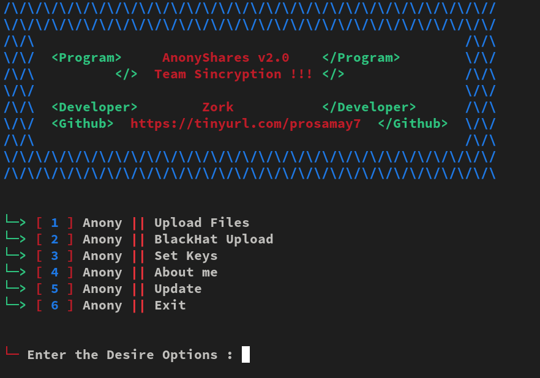

# AnonySharesv2.0 Free Version 
 

- What is AnonySharesv2.0 Free Version System  ?
> This is file uploader in different apis.
> Many times you just want to store your files and upload files multiple quickly.
> If you find yourself in that situation then this Anonymous Uploader will be best for you!
> You can send upload unlimited. This awesome app works with every operator/carrier.
> this tool made by @samay825

 

- AnonySharesv2.0 Free Version 

* `Upload files quickly within a secs.`

* `Supports newest Android also.`

* `Instant upload or chose a delay.`

* `Working with all Operators/Carriers.`

* `No missing Api issues, all files will be upload in sequence.`

*  For Paid Version Contact Instagram : @sincryptasur  

 

- Support

> `termux and all linux s.etc..`

> `before update works only india.`

> `Apis and more threads.`
 
  

- Installation & Step's
 
> `apt update && apt upgrade`
 
> `git clone https://github.com/samay825/AnonySharesv2.0`
 
> `cd AnonySharesv2.0`  

> `python3 main.py`

 

<h3>Visitors :</h3>
 

